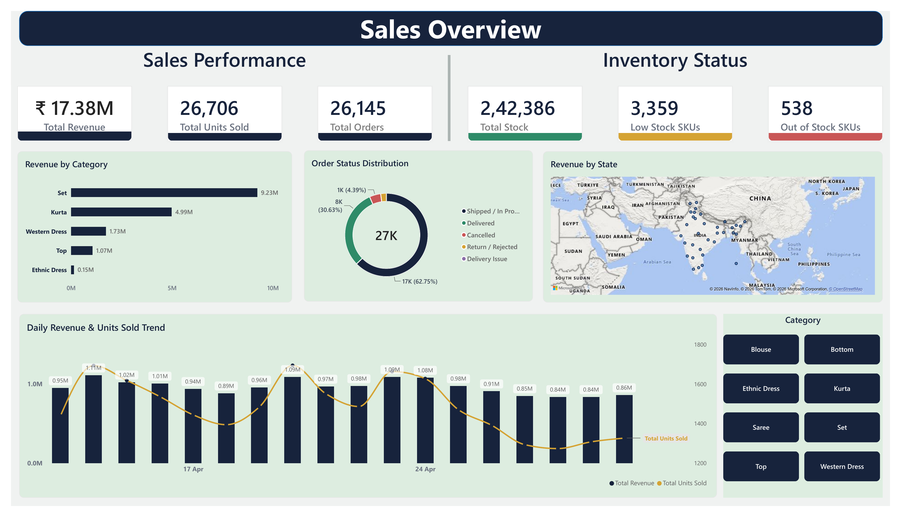
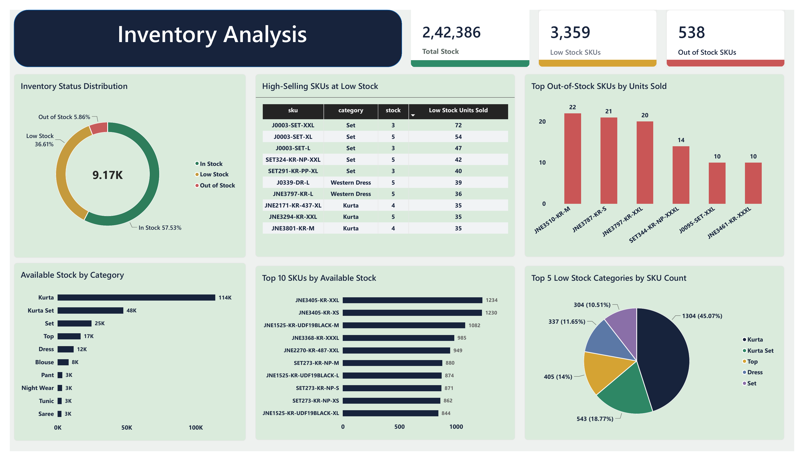

# Fashion Retail Sales & Inventory Analytics

## Project Overview

This is an end-to-end Data Analytics project focused on analyzing fashion retail sales and inventory data.

The project demonstrates the complete analytics workflow using **Python, MySQL, and Power BI** — from data cleaning and preprocessing to SQL-based business analysis and interactive dashboard development.

The analysis focuses on sales performance, customer orders, product and category performance, geographic sales trends, order status, and inventory availability.

---

## Tools & Technologies

- **Python** – Data cleaning and preprocessing
- **Pandas & NumPy** – Data manipulation and transformation
- **MySQL** – Data storage and business analysis using SQL
- **Power BI** – Data modeling, DAX measures, visualization, and dashboard development
- **Jupyter Notebook** – Python development and analysis
- **GitHub** – Project documentation and portfolio presentation

---

## Project Workflow

**Raw Data → Python Data Cleaning → Cleaned Data → MySQL Analysis → Power BI Dashboard → Business Insights**

### Python – Data Cleaning & Preprocessing

Python and Pandas were used to prepare the raw sales and inventory datasets for analysis.

Key tasks included:

- Standardizing column names
- Handling missing values
- Correcting and transforming data types
- Cleaning categorical values
- Creating additional analytical columns
- Preparing sales and inventory datasets for SQL and Power BI

The complete Python notebook is available in the `python` folder.

---

## Dataset

The project uses sales and inventory datasets containing information about:

- Orders
- Products and SKUs
- Product categories
- Quantity sold
- Revenue
- Order status
- Fulfillment
- Customer type
- Shipping location
- Product sizes
- Inventory stock
- Stock status

The full cleaned sales dataset contains **128,975 rows and 36 columns**.

A **30,000-row sample** containing all 36 columns is included in this repository to keep the GitHub dataset lightweight.

The cleaned inventory dataset is also included in the `data` folder.

---

## SQL Analysis

MySQL was used to analyze the cleaned sales and inventory data and answer business questions.

The analysis includes:

- Overall sales performance
- Revenue, units sold, and total orders
- Order status analysis
- Category performance
- State-wise sales performance
- Top-performing SKUs
- Size performance
- Fulfillment analysis
- B2B vs B2C customer analysis
- Day-of-week sales performance
- Inventory status
- Low-stock and out-of-stock products
- High-selling products with inventory risk

The complete SQL queries are available in the `sql` folder.

---

## Power BI Dashboard

An interactive Power BI dashboard was developed to present the analysis in a business-friendly format.

The dashboard contains two main pages.

### Sales Overview

The Sales Overview page focuses on:

- Total Revenue
- Total Units Sold
- Total Orders
- Revenue by Category
- Order Status Distribution
- Revenue by State
- Daily Revenue & Units Sold Trend
- Category filtering



### Inventory Analysis

The Inventory Analysis page focuses on:

- Total Stock
- Low Stock SKUs
- Out of Stock SKUs
- Inventory Status Distribution
- Available Stock by Category
- High-Selling SKUs at Low Stock
- Top Out-of-Stock SKUs by Units Sold
- Top SKUs by Available Stock
- Low Stock Categories



---

## Key Insights

- Total revenue analyzed: **₹17.38M**
- Total units sold: **26,706**
- Total orders: **26,145**
- Total available stock: **242,386**
- **Set** generated the highest category revenue.
- **Kurta** recorded the highest units sold among the major categories.
- **Maharashtra** generated the highest revenue among states.
- Amazon fulfillment contributed more revenue and units than merchant fulfillment.
- B2C customers accounted for the majority of sales.
- Inventory analysis identified high-selling SKUs with low stock levels, highlighting potential replenishment opportunities.

---

## Repository Structure

```text
fashion-retail-sales-inventory-analytics/
│
├── data/
│   ├── Amazon_Sales_Cleaned_GitHub.csv
│   ├── Inventory_Cleaned.csv
│   └── README.md
│
├── python/
│   ├── Amazon_Sale_Report.ipynb
│   └── README.md
│
├── sql/
│   ├── Fashion_Retail_Analytics_SQL.sql
│   └── README.md
│
├── powerbi/
│   ├── Fashion_Retail_Analytics.pbix
│   ├── Fashion_Retail_Analytics_Final_Dashboard.pdf
│   └── README.md
│
├── screenshots/
│   ├── Sales_Overview.png
│   ├── Inventory_Analysis.png
│   └── README.md
│
└── README.md
```

---

## Skills Demonstrated

**Python | Pandas | NumPy | Data Cleaning | Data Preprocessing | MySQL | SQL | Joins | Aggregations | Power BI | DAX | Data Modeling | Data Visualization | Business Analysis**

---

## Conclusion

This project demonstrates an end-to-end Data Analytics workflow by transforming raw fashion retail data into structured datasets, analyzing business performance using SQL, and presenting actionable sales and inventory insights through Power BI.

The project highlights how data analytics can support sales monitoring, product performance analysis, and inventory decision-making.
